# RAG Generator

A document question-answering workspace with separate knowledge bases, hybrid retrieval, cited answers, and explicit evaluation. Upload **PDF, DOCX, TXT, or Markdown**, ask questions about the selected collection, and inspect supporting source excerpts.

Built with **Python 3.11+, Streamlit, PostgreSQL with pgvector, Redis, and Celery**. Streamlit handles presentation; ingestion, retrieval, providers, security, caching, and evaluation live in separate service modules.

The application quotes supported passages and abstains when evidence is insufficient. It is intended for a trusted local workspace; authentication and public multi-user hosting are not implemented.

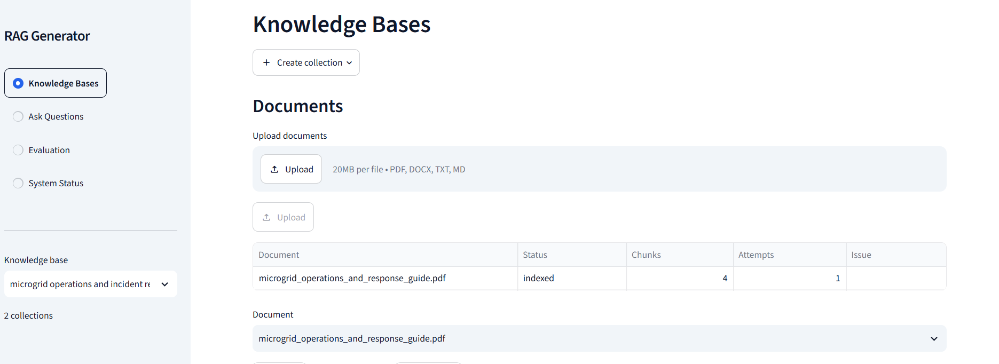

## Contents

- [Features](#features)
- [Architecture](#architecture)
- [RAG workflow](#rag-workflow)
- [Docker setup](#docker-setup)
- [Using the application](#using-the-application)
- [Configuration](#configuration)
- [Evaluation](#evaluation)
- [Screenshots](#screenshots)
- [Development and testing](#development-and-testing)
- [Operations](#operations)
- [Troubleshooting](#troubleshooting)
- [Security and limitations](#security-and-limitations)
- [Project structure](#project-structure)
- [AI-agent transcripts](#ai-agent-transcripts)
- [Further documentation](#further-documentation)

## Features

| Capability | Implementation |
| --- | --- |
| Separate knowledge bases | Collection-scoped documents, retrieval, caches, and evaluation results |
| Background ingestion | Validation, extraction, source metadata, token chunking, indexing |
| Hybrid retrieval | Cosine vector search and English full-text search combined with Reciprocal Rank Fusion |
| Passage reranking | Local cross-encoder scores overlapping passages inside candidate chunks |
| Grounded answers | Structured claims, validated source IDs, supporting quotes, and citations |
| Safe outcomes | Answered, abstained, rejected, and temporarily unavailable responses |
| Reliability | Configurable primary/fallback LLMs, bounded transient retries, circuit counters |
| Cost controls | Embedding/answer caches; retrieval, context, history, and generation limits |
| Evaluation | Document-specific datasets, core metrics, optional RAGAS judge |
| Observability | Request details, service checks, filtered application logs, optional Langfuse |

HR policies and the microgrid guide are sample/reference fixtures. Application services are not restricted to either domain.

## Architecture

### Services and dependencies

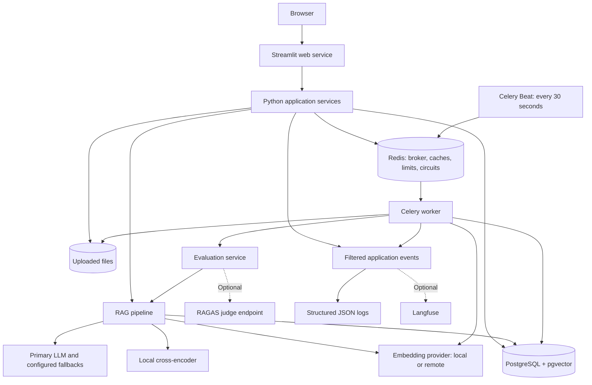

PostgreSQL holds durable job status. Celery Beat schedules a dispatcher through Redis; the worker discovers pending database jobs and queues ingestion/evaluation tasks. Expensive indexing and UI-requested evaluation run outside Streamlit.

| Compose service | Responsibility |
| --- | --- |
| `web` | Streamlit UI and synchronous question answering |
| `worker` | Ingestion and evaluation queues; concurrency one by default |
| `scheduler` | Celery Beat schedule for dispatch and recovery |
| `migrate` | One-shot database bootstrap, pgvector extension, full-text index |
| `db` | PostgreSQL 16 with pgvector |
| `redis` | Broker, caches, rate limits, and LLM circuit state |

Database/Redis health checks gate startup. `migrate` must complete before application services start; its successfully exited container is normal.

### Data model and isolation

| Entity | Stored information |
| --- | --- |
| Collection | UUID, name, revision, embedding-configuration fingerprint |
| Document | Collection UUID, filename, MIME, content hash, storage key, status, attempts, chunk count |
| Chunk | Collection/document UUIDs, text, page, heading, ordinal, content hash, embedding |
| Evaluation run | Collection UUID, run UUID, status, report JSON, error code |

Raw files live under collection/document UUID paths in shared storage. PostgreSQL stores metadata, chunks, vectors, and evaluation reports. Redis holds caches and operational state. Chat history lives in the Streamlit session; there is no durable chat-history table.

Searches filter by `collection_id` and indexed-document status. Composite foreign keys prevent cross-collection chunk ownership. Duplicate content within a collection is rejected. Atomic publication increments the collection revision, while embedding fingerprints prevent incompatible vector configurations from being mixed.

## RAG workflow

### Document ingestion

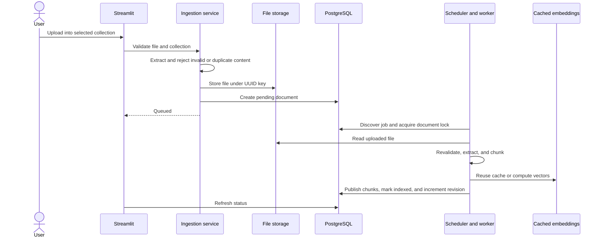

Validation checks extension, MIME type, signature, size, available page indicators, and usable text. DOCX processing bounds archive expansion and rejects macros/embedded objects. Encrypted PDFs and documents without usable text are rejected. **OCR is not built in.**

Chunking uses tiktoken, preserves page/heading boundaries, and prefers paragraph endings where possible. The example target is **600 tokens with 100-token overlap**; short sections remain shorter. PDF visual headings are not generally inferred, and table cells may become consecutive extracted lines.

The four-page microgrid PDF correctly produces **four page chunks** at the example settings. A small chunk count alone does not indicate missing text.

Advisory locks, unique constraints, and atomic publication make repeated job delivery idempotent. Indexed documents are skipped. Recoverable failures have bounded attempts; **Retry** resets a failed document after its underlying issue is resolved.

### Question answering

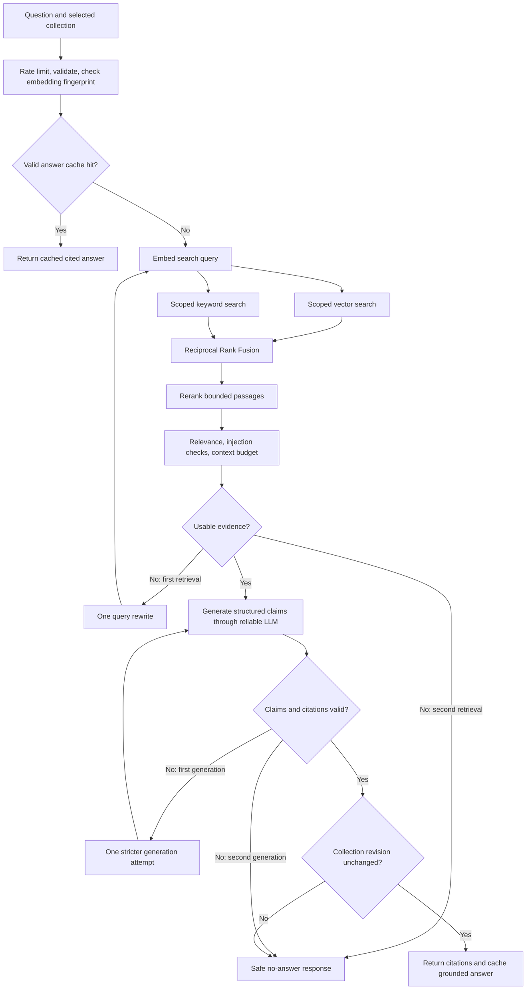

**Hybrid retrieval:** pgvector cosine distance supplies semantic candidates. PostgreSQL English `to_tsvector`, `plainto_tsquery`, and `ts_rank_cd` supply keyword candidates. RRF combines positions using `sum(1 / (60 + rank))`, deduplicated by chunk UUID, rather than averaging raw search scores.

**Passage reranking:** the cross-encoder uses its own tokenizer to score overlapping passages. Each original chunk receives its highest passage score, transformed by a sigmoid. Defaults are **180 tokens, 40 overlap, at most 16 passages per candidate**. Capped windows are spread across the source. Generation/citations retain original text and provenance. Existing collections benefit without re-embedding.

**Grounding:** the LLM returns JSON claims with text, a chunk UUID, and a quote. Validation checks source membership, claim/quote agreement, source support, and unsafe patterns. A whitespace-normalized fallback accommodates line breaks. The system favors excerpts over free-form synthesis. Operator procedures can be quoted as reference facts; document instructions addressed to the assistant remain untrusted.

**Safe outcomes:** insufficient evidence or unsupported generated claims produce abstention. A document explicitly stating that a topic is unspecified can support a cited explanation of its scope. Confidence is a reranker-based heuristic, not a calibrated probability or truth guarantee.

### Bounded work and caching

| Control | Example or enforced limit |
| --- | --- |
| Vector / keyword candidates | 20 / 20 maximum |
| Reranked candidates | 10 maximum |
| Context chunks | Up to 5 by default; configurable cap 4–6, with fewer allowed |
| Context / output budget | 3,500 / 1,200 tokens in the example |
| Retrieval attempts / query rewrites | At most 2 / 1 |
| Answer-generation attempts | At most 2 |
| LLM attempts per model, per operation | At most 3 |
| History / claims | Up to 6 prior messages in the example / at most 8 claims |

The LLM wrapper retries transient timeouts, connection failures, HTTP 429, and HTTP 5xx with exponential backoff and jitter. Non-transient errors are not retried on the same model. Ordered fallbacks can use another model on the primary endpoint and an alternate provider. Safety refusals stop fallback. Redis circuit counters temporarily skip repeatedly failing providers. Embedding/indexing failures follow separate paths; the LLM retry wrapper does not wrap every service.

Embedding keys include collection, model configuration, query/document purpose, and hashed content. Answer keys include collection revision, normalized question, pipeline/model configuration, and bounded history. Only grounded answers are cached. Document changes advance revisions; deletion also clears collection caches. Different history can cause a repeated question to miss the cache.

## Docker setup

### Prerequisites

- Docker Desktop with Linux containers, or Docker Engine with Compose on Linux.
- Internet for initial image/model downloads and any remote providers.
- Memory/disk capacity for PyTorch, models, database, and documents; requirements depend on model choices. The image installs CPU PyTorch.
- A working remote LLM configuration or a reachable Ollama server with the configured model available.

Run commands from the repository root. Examples use PowerShell unless marked otherwise.

### 1. Configure the environment

```powershell
Copy-Item .env.example .env
```

Copy only on first setup; preserve an existing `.env`. Before starting:

1. Replace `POSTGRES_PASSWORD` and use the matching password in host-side `DATABASE_URL`. URL-encode URL-special characters in that URL's credentials.
2. Configure the primary LLM key/model/endpoint.
3. Review the example Ollama fallback. Run it separately, or disable it with `LLM_FALLBACK_PROVIDER=`.
4. Choose embeddings; remote embeddings require an endpoint, key, and matching dimension.
5. Select the evaluation dataset for your documents when ready to evaluate.

[.env.example](.env.example) contains configurable examples, not model-availability guarantees. Keep credentials in environment configuration and never commit `.env`.

### 2. Build and start

```powershell
docker compose up -d --build
docker compose ps
```

Open [http://localhost:8501](http://localhost:8501), or your configured `APP_PORT`. Compose supplies internal database/Redis URLs with container hostnames; native Python uses `.env` URLs.

First indexing may load a local embedding model. The first question in each process loads the reranker. Docker's shared `app_data` volume persists model downloads.

### 3. Add sample documents

Create a collection and upload [microgrid_operations_and_response_guide.pdf](tests/fixtures/microgrid_operations_and_response_guide.pdf). Wait for `indexed`, then try:

- What is the normal battery state-of-charge range?
- What should an operator do if battery state of charge falls below 35%?
- What is the exact purchase price of the backup generator?

The last question tests abstention because that price is not specified.

Alternatively, queue the synthetic HR collection:

```powershell
docker compose exec web python -m src.cli seed-demo
```

This queues `sample_docs/hr_policies/` files and prints the collection UUID. Dispatch occurs every 30 seconds; completion also depends on worker load and providers.

## Using the application

| Page | Workflow |
| --- | --- |
| **Knowledge Bases** | Create/select collections, upload files, inspect indexing/chunk counts, retry failures, delete data |
| **Ask Questions** | Ask about the selected collection; inspect citations, confidence, timing, and request details |
| **Evaluation** | Queue a run for the configured dataset; inspect metrics and individual results |
| **System Status** | Check database/Redis, worker availability, provider configuration, model state, and recent errors |

The sidebar selector controls collection scope. Documents refresh every five seconds and evaluation status every ten seconds. History is separate per collection within the browser session.

Request details distinguish missing relevant evidence from a response without valid supported claims. Service/provider failures are unavailable responses rather than successful abstentions.

## Configuration

[.env.example](.env.example) is the deployment template; [src/config.py](src/config.py) defines Pydantic defaults/validation. Listed examples do not describe private local overrides.

### Providers and infrastructure

| Variables | Purpose |
| --- | --- |
| `LLM_PROVIDER`, `LLM_MODEL`, `LLM_BASE_URL`, `LLM_API_KEY` | Primary LLM; adapters: `groq`, `gemini`, `ollama` |
| `LLM_SAME_PROVIDER_FALLBACK_MODEL` | Optional second model on primary endpoint |
| `LLM_FALLBACK_PROVIDER`, `LLM_FALLBACK_MODEL`, `LLM_FALLBACK_BASE_URL`, `LLM_FALLBACK_API_KEY` | Optional alternate provider |
| `EMBEDDING_PROVIDER`, `EMBEDDING_MODEL`, `EMBEDDING_DIMENSION` | `local` or `gemini`; dimensions must match returned vectors |
| `EMBEDDING_BASE_URL`, `EMBEDDING_API_KEY` | Remote embedding endpoint/credential |
| `RERANKER_PROVIDER`, `RERANKER_MODEL`, `MODEL_DEVICE` | Local reranker/device; example device `cpu` |
| `TOKENIZER_ENCODING` | Stored-chunk/context tokenizer |
| `POSTGRES_DB`, `POSTGRES_USER`, `POSTGRES_PASSWORD` | Database initialization credentials |
| `DATABASE_URL`, `REDIS_URL` | Native service URLs; Compose overrides internal connections |
| `POSTGRES_PORT`, `REDIS_PORT`, `APP_PORT` | Example loopback ports 55432, 56379, 8501 |
| `STORAGE_ROOT`, `RESULTS_ROOT` | Native file/report roots; Compose uses `/app/data/uploads` and `/app/data/evaluations` |

The Groq adapter expects its chat API base ending in `/openai/v1`; Gemini appends model paths to its REST base, typically ending in `/v1beta`; Ollama appends `/api/chat` to its origin. RAGAS uses a separate OpenAI-compatible endpoint. Credentials are not interchangeable.

Ollama is not a Compose service. The template's `host.docker.internal` endpoint is for containers accessing a host server; native processes need a suitable host-reachable origin.

Changing embedding provider/model/dimension/endpoint changes the collection fingerprint. Create a new collection and upload using the new configuration; there is no in-place migration UI. Reranker-only changes do not require re-embedding.

### Limits and observability

| Variables | Example values / behavior |
| --- | --- |
| `MAX_UPLOAD_MB`, `MAX_PAGES`, `MAX_EXTRACTED_CHARACTERS` | 20 MB / 100 pages / 2,000,000 characters |
| `CHUNK_TOKENS`, `CHUNK_OVERLAP` | 600 / 100; allowed ranges 450–700 / 80–120 |
| `VECTOR_TOP_K`, `KEYWORD_TOP_K`, `RERANK_TOP_K` | 20 / 20 / 10 |
| `RERANKER_PASSAGE_TOKENS`, `RERANKER_PASSAGE_OVERLAP`, `RERANKER_MAX_PASSAGES` | 180 / 40 / 16; overlap smaller than passage size |
| `MIN_RERANK_SCORE` | 0.55; evaluate suitability for your model/documents |
| `CONTEXT_TOP_K`, `MAX_CONTEXT_TOKENS`, `MAX_OUTPUT_TOKENS` | 5 / 3,500 / 1,200 |
| `LLM_TIMEOUT_SECONDS`, `LLM_MAX_ATTEMPTS` | 30 seconds per HTTP call / 3 attempts; not a total request deadline |
| `CIRCUIT_FAILURE_THRESHOLD`, `CIRCUIT_COOLDOWN_SECONDS` | 3 / 60 |
| `CHAT_HISTORY_MESSAGES` | 6; zero disables history supplied to pipeline |
| `ANSWER_CACHE_TTL`, `EMBEDDING_CACHE_TTL` | 3,600 / 604,800 seconds |
| `CHAT_RATE_LIMIT`, `UPLOAD_RATE_LIMIT`, `RATE_WINDOW_SECONDS` | 20 chats / 10 uploads per collection/session principal per 60 seconds |
| `OBSERVABILITY_ENABLED`, `LANGFUSE_HOST`, `LANGFUSE_PUBLIC_KEY`, `LANGFUSE_SECRET_KEY` | Optional filtered application tracing; disabled in template |
| `STREAMLIT_THEME_BASE`, `STREAMLIT_THEME_PRIMARY_COLOR`, `STREAMLIT_THEME_BACKGROUND_COLOR`, `STREAMLIT_THEME_SECONDARY_BACKGROUND_COLOR`, `STREAMLIT_THEME_TEXT_COLOR` | Native theme applied by Compose |
| `STREAMLIT_BROWSER_GATHER_USAGE_STATS` | Disabled by Compose |

## Evaluation

Evaluation is explicit and separate from chat. UI runs are stored in PostgreSQL and queued for Celery. CLI runs execute directly and do not create dashboard run records.

### Datasets

| Dataset | Cases | Required collection |
| --- | --- | --- |
| [HR](evals/dataset.json) | 10 | All five indexed files in `sample_docs/hr_policies/` |
| [Microgrid](evals/microgrid_dataset.json) | 10: 8 answerable, 2 unanswerable | Indexed microgrid PDF with its expected filename |
| [Security fixtures](evals/security_dataset.json) | 10 | Separate validator checks, not extra document questions |

For microgrid evaluation:

```dotenv
EVAL_DATASET_PATH=./evals/microgrid_dataset.json
EVAL_MAX_QUESTIONS=10
EVAL_REQUEST_DELAY_SECONDS=1.0
```

The dataset is global environment configuration, not automatically selected per collection. Switch it when evaluating another corpus. Required filenames must be indexed; mismatches fail validation before questions run. The first `EVAL_MAX_QUESTIONS` cases are used in file order. Pacing reduces bursts but cannot guarantee avoidance of provider quota limits.

Cases contain `id`, `question`, `category`, `expected_sources`, `reference`, and `answerable`. Labels use `filename|heading`; this PDF uses `microgrid_operations_and_response_guide.pdf|None` because visual headings are not extracted as heading metadata. Unanswerable cases have empty source lists. See the [microgrid dataset guide](evals/microgrid_dataset.md) for page references.

### Run through the UI

1. Apply dataset/environment changes using [Applying changes](#applying-changes).
2. Select the matching collection and confirm required documents are `indexed`.
3. Open **Evaluation** and click **Run evaluation** once.
4. Wait for `pending` → `processing` → `completed` or `failed`.
5. Inspect the summary, latency chart, and **Question results**.

Ingestion and evaluation share one worker process by default. A long evaluation can delay indexing. Reports are stored as PostgreSQL JSON and as Markdown under `RESULTS_ROOT/<collection-id>/<run-id>.md`.

### CLI alternatives

These commands run evaluations; they are not setup checks.

Offline HR lexical baseline, after installing Python dependencies:

```powershell
python -m evals.run_eval --offline --output ./data/evaluations/hr-offline.md
```

Offline mode always uses the bundled HR Markdown files and default HR dataset. It ignores `EVAL_DATASET_PATH` and measures a TF-IDF baseline plus deterministic security checks. It requires no running database or API key and does not test live pgvector/embeddings/reranking/LLM quality.

Live evaluation inside Docker:

```powershell
$collectionId = "replace-with-your-collection-uuid"
docker compose exec web python -m evals.run_eval --collection-id $collectionId --output /app/data/evaluations/manual-report.md
```

Use a real UUID, not a collection name. The seed command prints it; existing collections can be listed read-only:

```powershell
docker compose exec web python -c "from src.runtime import get_runtime; print('\n'.join(str(c.collection_id) + ' ' + c.name for c in get_runtime().repository.collections()))"
```

Live evaluation uses configured providers and consumes their resources/quota. It measures retrieval/reranking separately before calling the answer pipeline, so reported answer latency is not total evaluation-case latency. Answer caching remains enabled; compare cache-hit state when interpreting timings.

### Metrics and interpretation

| Metric | Meaning / limitation |
| --- | --- |
| Recall@5 / MRR@10 | Relevant filename/heading labels in ranked retrieval; not proof of correct final context or answers |
| Citation accuracy | Mean per-answer fraction with exact stored excerpts and expected source labels |
| Extractive faithfulness | Mean per-answer fraction of citations with exact stored-text support |
| Lexical answer relevance | Case-insensitive exact reference substring; not semantic correctness |
| No-answer precision | Truly unanswerable cases divided by all `abstained` cases; failures/unavailable results excluded |
| P50 / P95 latency | Answer-pipeline percentiles affected by model loading, providers, retries, and caches |
| Cache hit rate / average LLM calls | Operational answer-request measurements |
| Security fixture pass rate | Deterministic pattern checks, not a complete adversarial benchmark |

`None` / **Not measured** means unavailable, not zero. PDF retrieval labels here are document-level because all pages share one filename and missing heading. Evaluation quote checks require exact whitespace, whereas the answer validator has a whitespace-normalized fallback. Valid PDF answers can therefore score poorly after line-break normalization. Multi-passage answers and reference formatting can also depress lexical scores.

### Captured microgrid result

The supplied screenshots show one completed ten-case run:

| Observation | Captured value |
| --- | --- |
| Recall@5 / MRR@10 | 100% / 1.0000 |
| Citation accuracy / extractive faithfulness | Approximately 47.6% / 47.6% |
| No-answer precision | 66.7% |
| Answerable questions answered | 7 of 8; quarterly maintenance case `microgrid-08` abstained |
| Unanswerable questions | Both abstained |
| P50 / P95 answer latency | Approximately 2.18 / 10.20 seconds |

Two correct abstentions among three total abstentions explain the 66.7% value. The coarse labels and whitespace mismatch limit conclusions from other percentages. These are captured observations, not universal quality or performance guarantees.

### Optional RAGAS judge

```dotenv
EVAL_ENABLE_RAGAS=true
EVAL_LLM_MODEL=your-judge-model
EVAL_LLM_BASE_URL=your-openai-compatible-base-url
EVAL_LLM_API_KEY=your-judge-key
```

RAGAS measures semantic faithfulness and reference-context recall with a separate judge. It sends questions, answers, context, and reference answers to that endpoint and can incur additional API usage. The implementation caps judge samples at ten and uses one judge worker. It never runs during ordinary chat.

**The current Dockerfile installs `requirements-eval.txt`.** Native installations need `python -m pip install -r requirements-eval.txt`. Judge execution is disabled in `.env.example`; installation alone does not enable it. A judge error can leave the main report completed with a failed/skipped judge section. The dashboard shows core metrics, not the nested RAGAS result; inspect the stored report for judge status.

## Screenshots

These screenshots show the supplied microgrid session; times and scores belong to that session.

### Cited answer

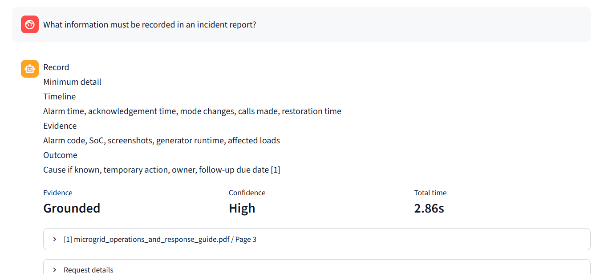

### Safe abstention and diagnostics

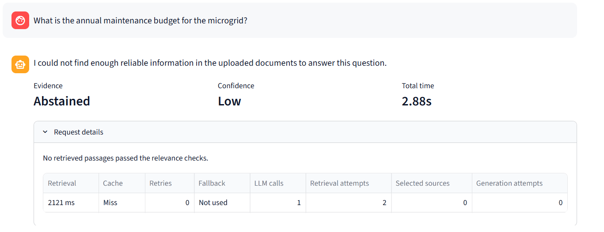

### Cited explanation of a document boundary

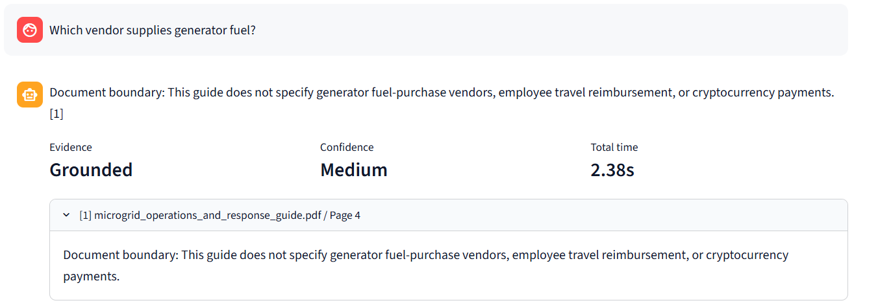

### Evaluation summary

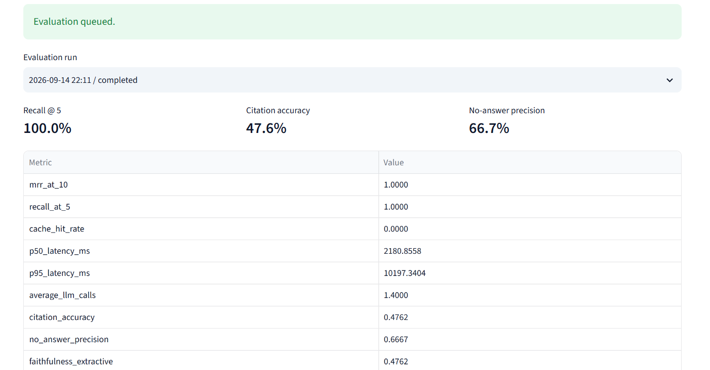

<details>
<summary>More screenshots: latency, question results, and collection navigation</summary>

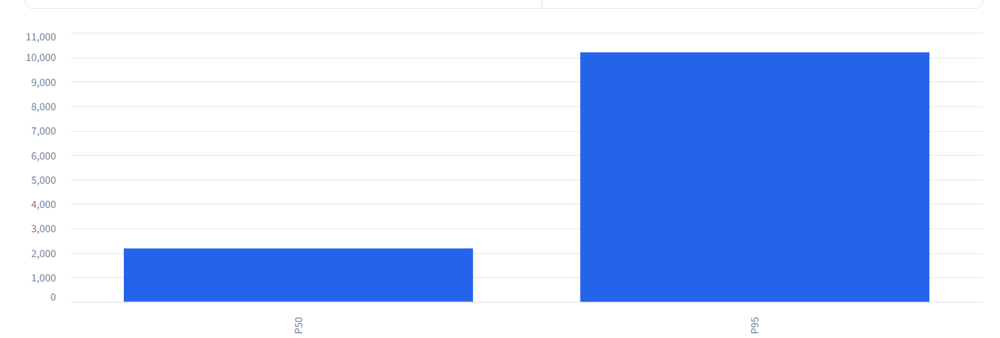

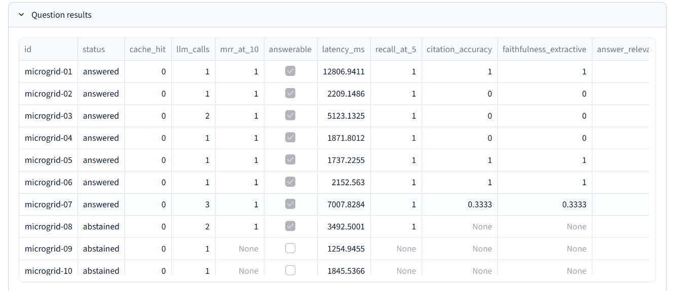

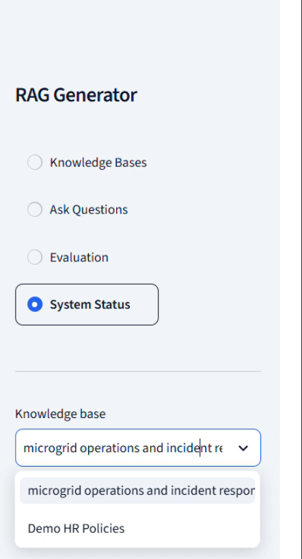

</details>

## Development and testing

### Host-side Python tools

Use Python **3.11+**. The Docker image uses 3.11. From the repository root:

```powershell
python -m venv venv
.\venv\Scripts\Activate.ps1
python -m pip install -r requirements-dev.txt
python -m pytest -q -m "not integration"
python -m ruff check src tests worker evals app.py
```

If activation is unavailable, invoke `.\venv\Scripts\python.exe` directly. Tests use model doubles, but tiktoken may download vocabulary on first use; warm that cache before offline runs. Test artifacts are configured under `data/`.

Coverage includes validation, extraction/chunking, collection isolation, model adapters, retry/fallback behavior, circuit state, caching, RRF, passage limits, grounding, abstention, evaluation metrics, and Streamlit navigation. The PDF fixture also exercises upload, indexing, and citations.


### PostgreSQL/Redis integration tests

```powershell
docker compose up -d db redis
python -m src.migrate
$env:RUN_INTEGRATION = "1"
python -m pytest -q -m integration
Remove-Item Env:RUN_INTEGRATION
```

Host-side URLs must match published ports and credentials. Tests create unique collections and remove their own data. They use real PostgreSQL/pgvector/Redis and deterministic provider doubles, verifying integration rather than live model quality.

### Native application development

Use Linux or WSL for the complete native UI/worker workflow. Run all application processes from the same checkout with matching environment and storage paths. PostgreSQL/Redis may remain in Docker. Avoid pairing a native uploader's files with workers that can only see Docker's named volume.

After installing dependencies and running `python -m src.migrate`, use separate terminals with the virtual environment active:

```bash
# Terminal 1
streamlit run app.py

# Terminal 2
celery -A worker.tasks:celery_app worker --loglevel=WARNING --concurrency=1 -Q ingestion,evaluation

# Terminal 3
celery -A worker.tasks:celery_app beat --loglevel=WARNING --schedule=./data/celerybeat-schedule
```

Use Compose for the full application on Windows. Pydantic reads service settings from `.env`; native launches must separately export `STREAMLIT_THEME_*` values to reproduce the Compose theme. Stop competing Compose application workers/schedulers before switching to a native workflow against the same database.

## Operations

### Applying changes

| Change | Action |
| --- | --- |
| Source, dependencies, or added/edited evaluation JSON | Rebuild images and recreate application services |
| `.env` only | Recreate application services to receive new environment |
| UI-uploaded documents | Wait for indexing; no image rebuild |
| Embedding configuration | Recreate services, then create/repopulate a compatible collection |
| README/screenshots only | No running-service restart needed |

Source and evaluation JSON are copied into images, not bind-mounted.

```powershell
# Code or dataset changes
docker compose up -d --build web worker scheduler

# Environment-only changes
docker compose up -d --force-recreate web worker scheduler
```

`docker compose restart` does not rebuild code or reload modified environment values into existing containers. Changing dataset configuration does not queue an evaluation. Historical reports retain their stored results.

### Health and logs

```powershell
docker compose ps
docker compose exec web python -m src.cli health
docker compose logs --tail 100 web worker scheduler migrate
```

The UI additionally pings workers. **Configured (not probed)** does not confirm a successful LLM request. Recent errors are process-local; inspect worker logs for background failures.

### Persistent data

| Volume | Contents |
| --- | --- |
| `postgres_data` | Collections, document metadata, chunks/vectors, reports, schema version |
| `redis_data` | Redis AOF, caches, broker/control state |
| `app_data` | Uploaded files, model cache, report summaries, scheduler state |

```powershell
docker compose stop
docker compose start
```

Stopping/recreating containers preserves volumes. Back up PostgreSQL and uploaded files together before upgrades; no automated backup/restore workflow is included. Changing `POSTGRES_PASSWORD` in `.env` does not rotate credentials in an initialized PostgreSQL volume.

`docker compose down -v` deletes named volumes and is destructive; it is not a routine restart command. UI document/collection deletion also removes stored data.

## Troubleshooting

| Symptom | Check / next step |
| --- | --- |
| Docker cannot connect | Start Docker Desktop/Engine and select Linux containers |
| Configuration incomplete | Compare required fields with `.env.example`; recreate services after edits |
| Database unavailable | Inspect health/migration logs, ports, and credentials; initialized volumes retain original password |
| Upload/evaluation stays pending | Confirm `worker` and `scheduler`; dispatch is every 30 seconds and queues share one worker |
| Document failed | Inspect issue code/logs, resolve file/provider cause, then **Retry** |
| Microgrid PDF has four chunks | Expected: four short pages retained at the example settings |
| PDF has no usable text | Supply an unlocked text-searchable PDF; perform OCR beforehand |
| Supported question abstains | Check collection/indexing, source text, and request-detail reason; evaluate relevance settings |
| Model temporarily unavailable | Check endpoint/model/key, quota, circuits, and fallback availability |
| First question is slow | Allow model loading/downloads; compare warm requests and cache state |
| New JSON not used | Set `EVAL_DATASET_PATH`, rebuild images, recreate worker and web |
| Evaluation validation failure | Confirm required filenames and matching embedding configuration |
| High recall, lower citation scores | Review coarse labels and exact-whitespace checks before interpreting quality |
| RAGAS metrics missing | Check opt-in settings, judge credentials/endpoint, and stored report; UI shows core metrics |
| Embedding configuration changed | Create a collection indexed with current configuration |

## Security and limitations

### Data handling

- Documents, questions, and history are untrusted. Uploaded content is not executed; the answer model receives no shell/browser tools.
- File checks, extraction limits, archive restrictions, and storage-path validation reject common malformed inputs. They are not antivirus scanning or a fully isolated parser.
- Injection patterns complement prompt separation, context limits, and citations. They can produce false positives and cannot guarantee protection from all obfuscated attacks or poisoned sources.
- Answers/citations use Streamlit plain-text rendering to avoid activating document-supplied HTML, links, or remote images.
- Rate limits use a session principal and Redis atomic counters. They do not substitute for authentication or identity-based abuse controls.
- Remote LLMs receive questions, bounded history, and evidence. Remote embeddings receive text being embedded. Optional RAGAS receives evaluation content. Local storage does not imply fully local inference.
- Application telemetry allowlists metadata and omits raw documents, questions, answers, keys, and exception messages. Langfuse receives filtered application telemetry; third-party SDK logging is a separate concern.
- `.env` is excluded from Git and the build context. Do not add credentials or private content to fixtures, screenshots, or documentation.

Default ports bind to loopback. Public/multi-user deployment requires authentication, collection authorization, identity-bound limits, TLS, parser isolation, malware scanning, backups, and infrastructure controls. Collection filtering is not access control.

### Known limitations

- Extractive grounding can abstain on valid synthesis, calculation, or multi-passage questions. Quotes do not prove that a source is true or relevant.
- PDF extraction has no OCR or guaranteed visual table reconstruction. Partially scanned files can have unextracted pages; DOCX locations depend on stored metadata/breaks.
- English full-text search and model selection affect language/domain coverage. Long keyword queries can be restrictive because `plainto_tsquery` combines remaining terms conjunctively.
- Token-dense sources can exceed bounded passage coverage; relevance thresholds need domain evaluation.
- The ten-case microgrid run has imperfect outcomes. Document-level recall and lexical/whitespace metrics are not semantic answer accuracy.
- UI evaluation uses a global dataset and shares ingestion workers. Reports do not snapshot the full dataset/model configuration for historical reproducibility.
- Vector search is exact; no HNSW/IVFFlat index is configured. A full-text GIN index is created.
- There is no authentication, durable chat-history table, in-place embedding migration UI, GPU provisioning in Compose, or automated backup workflow.
- Dependencies use version ranges rather than a fully locked environment. Behavior/timings can vary by installation and provider.

## Project structure

```text
rag-generator/
├── app.py                       # Streamlit entry point and navigation
├── src/
│   ├── config.py                # Pydantic environment settings
│   ├── runtime.py               # Service composition and health checks
│   ├── database.py              # SQLAlchemy session lifecycle
│   ├── migrate.py               # Versioned database bootstrap
│   ├── repository.py            # Scoped persistence and job state
│   ├── cli.py                   # Demo seeding and health commands
│   ├── models/                  # ORM entities and request/response schemas
│   ├── ingestion/               # Validation, extraction, chunking, indexing
│   ├── rag/                     # Retrieval, orchestration, grounding
│   ├── providers/               # Provider contracts and adapters
│   ├── security/                # Input checks and rate limits
│   ├── cache/                   # Redis keys, TTLs, invalidation
│   ├── observability/           # Filtered application events
│   ├── evaluation/              # Datasets, metrics, reports, optional judge
│   └── ui/                      # Streamlit pages and styling
├── worker/                      # Celery tasks and scheduled dispatch
├── evals/                       # HR/microgrid/security datasets and CLI
├── sample_docs/hr_policies/     # Synthetic HR samples
├── tests/                       # Unit, UI, integration, regression tests
│   └── fixtures/                # Microgrid PDF
├── images/                      # Screenshots used in this README
├── docs/                        # Decisions and verification notes
├── data/                        # Ignored native runtime/test artifacts
├── .env.example                 # Template for ignored .env
├── Dockerfile                   # CPU image including eval dependencies
├── docker-compose.yml           # Six services and three named volumes
├── requirements.txt             # Application dependencies
├── requirements-dev.txt         # Application plus test/lint dependencies
├── requirements-eval.txt        # RAGAS/judge dependencies
└── pyproject.toml               # Pytest and Ruff settings
```

## AI-agent transcripts

The project includes [AI-agent transcripts](docs/ai-transcripts/README.md)
for the initial implementation, UI changes, and PDF/evaluation/documentation work.
Each is available as readable Markdown and structured JSONL, with user prompts, tool
activity, and a manifest.

## Further documentation

- [Engineering decisions](docs/decisions.md): architecture rationale and trade-offs.
- [Implementation plan](docs/implementation-plan.md): original phases; source defines current behavior.
- [PDF regression verification](docs/pdf-regression-verification.md): earlier extraction/reranking investigation and live checks.
- [Microgrid evaluation guide](evals/microgrid_dataset.md): ten cases, page references, and scoring caveats.
- [Project instructions](AGENTS.md): engineering, security, and testing expectations.